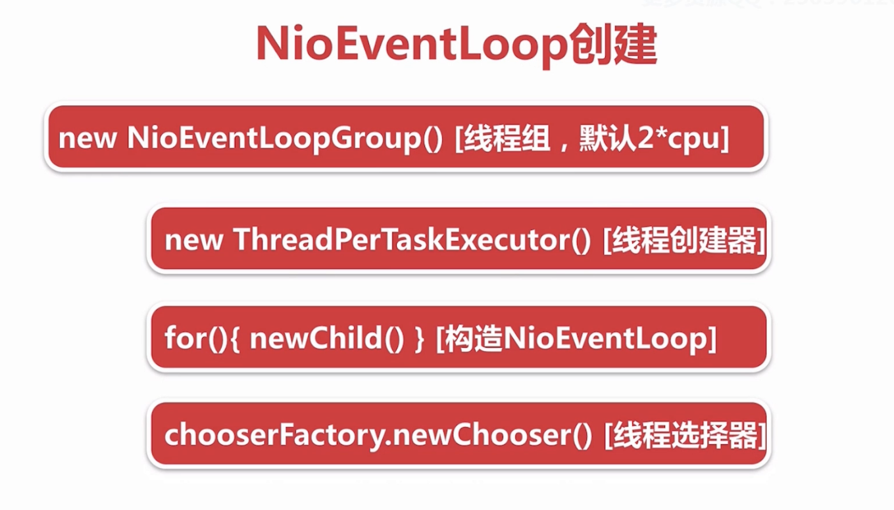
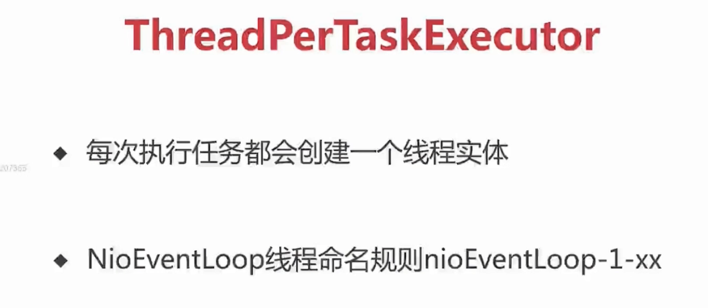
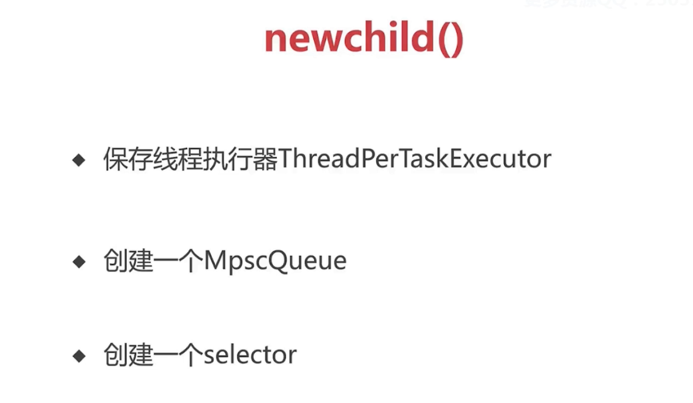

# NioEventLoop
## NioEventLoop 的创建
### 
创建流程

默认创建的NioEventLoop个数为2倍的cpu核数。
### 创建过程
#### 先看引导代码
    ...
    EventLoopGroup eventLoopGroup = new NioEventLoopGroup();
    ...
这里对NioEventLoopGroup的构造函数进行简单的分析，默认的无参构造函数最终调用的是

    public NioEventLoopGroup(int nThreads, Executor executor, finalSelectorProvider selectorProvider,final SelectStrategyFactory selectStrategyFactory) {
        super(nThreads, executor, selectorProvider, selectStrategyFactory, RejectedExecutionHandlers.reject());
    }
看一下父类中的实现

    protected MultithreadEventExecutorGroup(int nThreads, Executor executor,
                                            EventExecutorChooserFactory chooserFactory, Object... args) {
        if (nThreads <= 0) {
            throw new IllegalArgumentException(String.format("nThreads: %d (expected: > 0)", nThreads));
        }

        if (executor == null) {
            // 1
            executor = new ThreadPerTaskExecutor(newDefaultThreadFactory());
        }

        children = new EventExecutor[nThreads];

        for (int i = 0; i < nThreads; i ++) {
            boolean success = false;
            try {
                // 2
                children[i] = newChild(executor, args);
                success = true;
            } catch (Exception e) {
                // TODO: Think about if this is a good exception type
                throw new IllegalStateException("failed to create a child event loop", e);
            } finally {
                if (!success) {
                    for (int j = 0; j < i; j ++) {
                        children[j].shutdownGracefully();
                    }

                    for (int j = 0; j < i; j ++) {
                        EventExecutor e = children[j];
                        try {
                            while (!e.isTerminated()) {
                                e.awaitTermination(Integer.MAX_VALUE, TimeUnit.SECONDS);
                            }
                        } catch (InterruptedException interrupted) {
                            // Let the caller handle the interruption.
                            Thread.currentThread().interrupt();
                            break;
                        }
                    }
                }
            }
        }
        // 3
        chooser = chooserFactory.newChooser(children);

        final FutureListener<Object> terminationListener = new FutureListener<Object>() {
            @Override
            public void operationComplete(Future<Object> future) throws Exception {
                if (terminatedChildren.incrementAndGet() == children.length) {
                    terminationFuture.setSuccess(null);
                }
            }
        };

        for (EventExecutor e: children) {
            e.terminationFuture().addListener(terminationListener);
        }

        Set<EventExecutor> childrenSet = new LinkedHashSet<EventExecutor>(children.length);
        Collections.addAll(childrenSet, children);
        readonlyChildren = Collections.unmodifiableSet(childrenSet);
    }
- 创建线程创建器

    在看new ThreadPerTaskExecutor(newDefaultThreadFactory())这个构造函数之前，先看一下newDefaultThreadFactory()这个方法：

        protected ThreadFactory newDefaultThreadFactory() {
            return new DefaultThreadFactory(getClass());
        }
        // 最终调用的是这个构造方法
        // 这里的poolName 就是NioEventLoopGroup类的简单类型并将首字母转成小写
        // prefix将在后面创建线程的时候用上，这里prefix为nioEventLoopGroup-n-,n为线程创建器的id
        public DefaultThreadFactory(String poolName, boolean daemon, int priority, ThreadGroup threadGroup) {
            if (poolName == null) {
                throw new NullPointerException("poolName");
            }
            if (priority < Thread.MIN_PRIORITY || priority > Thread.MAX_PRIORITY) {
                throw new IllegalArgumentException(
                        "priority: " + priority + " (expected: Thread.MIN_PRIORITY <= priority <= Thread.MAX_PRIORITY)");
            }

            prefix = poolName + '-' + poolId.incrementAndGet() + '-';
            this.daemon = daemon;
            this.priority = priority;
            this.threadGroup = threadGroup;
        }

    再来看看ThreadPerTaskExecutor类：

        public final class ThreadPerTaskExecutor implements Executor {
            private final ThreadFactory threadFactory;

            public ThreadPerTaskExecutor(ThreadFactory threadFactory) {
                if (threadFactory == null) {
                    throw new NullPointerException("threadFactory");
                }
                this.threadFactory = threadFactory;
            }

            @Override
            public void execute(Runnable command) {
                threadFactory.newThread(command).start();
            }
        }
    可以看出ThreadPerTaskExecutor在调用execute方法的时候，使用我们刚刚创建的线程创建工厂来创建一个线程并启动。
    回过头来看看DefaultThreadFactory类中的newThread方法：

        public Thread newThread(Runnable r) {
            Thread t = newThread(new DefaultRunnableDecorator(r), prefix + nextId.incrementAndGet());
            try {
                if (t.isDaemon()) {
                    if (!daemon) {
                        t.setDaemon(false);
                    }
                } else {
                    if (daemon) {
                        t.setDaemon(true);
                    }
                }

                if (t.getPriority() != priority) {
                    t.setPriority(priority);
                }
            } catch (Exception ignored) {
                // Doesn't matter even if failed to set.
            }
            return t;
        }

        protected Thread newThread(Runnable r, String name) {
            return new FastThreadLocalThread(threadGroup, r, name);
        }
    可以看到这里创建的每一个线程的前缀都是我们在前面创建ThreadPerTaskExecutor时已经创建的prefix加上线程的id,FastThreadLocalThread继承自Thread，并对ThreadLocal进行了相应的优化处理。

- 创建线程

    看一下NioEventLoopGroup中newChild方法的具体实现：

        protected EventLoop newChild(Executor executor, Object... args) throws Exception {
            return new NioEventLoop(this, executor, (SelectorProvider) args[0],
                ((SelectStrategyFactory) args[1]).newSelectStrategy(), (RejectedExecutionHandler) args[2]);
        }

        NioEventLoop(NioEventLoopGroup parent, Executor executor, SelectorProvider selectorProvider,
                 SelectStrategy strategy, RejectedExecutionHandler rejectedExecutionHandler) {
            super(parent, executor, false, DEFAULT_MAX_PENDING_TASKS, rejectedExecutionHandler);
            if (selectorProvider == null) {
                throw new NullPointerException("selectorProvider");
            }
            if (strategy == null) {
                throw new NullPointerException("selectStrategy");
            }
            provider = selectorProvider;
            final SelectorTuple selectorTuple = openSelector();
            selector = selectorTuple.selector;
            unwrappedSelector = selectorTuple.unwrappedSelector;
            selectStrategy = strategy;
        }
    这里创建了selector

    继续查看父类实现,
    在SingleThreadEventExecutor类中：

        protected SingleThreadEventExecutor(EventExecutorGroup parent, Executor executor,
                                        boolean addTaskWakesUp, int maxPendingTasks,
                                        RejectedExecutionHandler rejectedHandler) {
            super(parent);
            this.addTaskWakesUp = addTaskWakesUp;
            this.maxPendingTasks = Math.max(16, maxPendingTasks);
            this.executor = ObjectUtil.checkNotNull(executor, "executor");
            taskQueue = newTaskQueue(this.maxPendingTasks);
            rejectedExecutionHandler = ObjectUtil.checkNotNull(rejectedHandler, "rejectedHandler");
        }
    这里将我们上一步创建的executor保存为executor属性，当NioEventLoop执行任务时需要创建底层的线程时使用。并创建了一个任务队列赋值给taskQueue属性，newTaskQueue方法在NioEventLoop中的实现：

        protected Queue<Runnable> newTaskQueue(int maxPendingTasks) {
            // This event loop never calls takeTask()
            return PlatformDependent.newMpscQueue(maxPendingTasks);
        }
    taskQueue是一个newMpscQueue队列，多个外部线程可以把任务都放入到taskQueue中，然后由一个NioEventLoop线程去消费。
