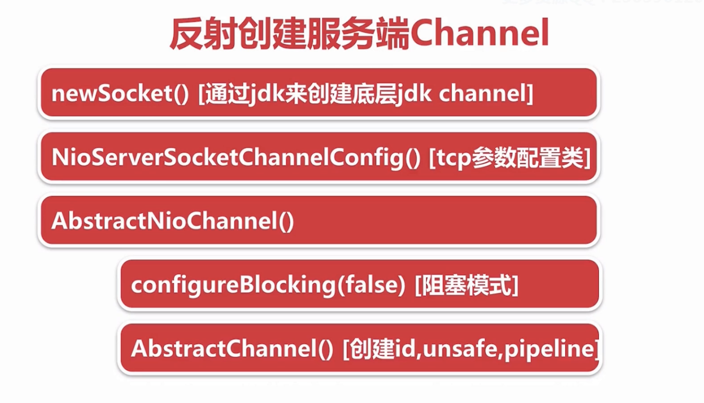

# 服务端Channel的创建过程
## 从netty源码层面跟踪服务端Channel的创建过程
大致流程

引导代码

        ServerBootstrap serverBootstrap = new ServerBootstrap();
        serverBootstrap.group(eventLoopGroup).channel(NioServerSocketChannel.class)
        ...
        ChannelFuture channelFuture = serverBootstrap.bind().sync();
其余代码略去。

### 首先看看Bootstrap的channel方法做了什么
在AbstractBootstrapl类中,

    public B channel(Class<? extends C> channelClass) {
        if (channelClass == null) {
            throw new NullPointerException("channelClass");
        }
        return channelFactory(new ReflectiveChannelFactory<C>(channelClass));
    }

    public B channelFactory(io.netty.channel.ChannelFactory<? extends C> channelFactory) {
        return channelFactory((ChannelFactory<C>) channelFactory);
    }

    public B channelFactory(ChannelFactory<? extends C> channelFactory) {
        if (channelFactory == null) {
            throw new NullPointerException("channelFactory");
        }
        if (this.channelFactory != null) {
            throw new IllegalStateException("channelFactory set already");
        }

        this.channelFactory = channelFactory;
        return (B) this;
    }
这里我们使用的是ServerBootstrap类,这里泛型B是ServerBootstrap类,C是ServerChannel

从在AbstractBootstrap类中的三个方法可以看出,调用channel(NioServerSocketChannel.class)方法其实是构造了一个ReflectiveChannelFactory<NioServerSocketChannel>类的实例,并将这个实例赋值给了AbstractBootstrap的成员变量channelFactory.

### bind方法是如何创建服务端Channel的

在AbstractBootstrap类中,

    public ChannelFuture bind(SocketAddress localAddress) {
        validate();
        if (localAddress == null) {
            throw new NullPointerException("localAddress");
        }
        return doBind(localAddress);
    }

    private ChannelFuture doBind(final SocketAddress localAddress) {
        final ChannelFuture regFuture = initAndRegister();
        ...
    }

    final ChannelFuture initAndRegister() {
        Channel channel = null;
        try {
            channel = channelFactory.newChannel();
            init(channel);
        } catch (Throwable t) {
            ...
        }
    }

可以看出bind方法在初始化的过程中通过成员变量channelFactory的newChannel方法创建Channel对象,而channelFactory对象则是上一步channel方法调用后构建的ReflectiveChannelFactory<NioServerSocketChannel>对象,在来看看ReflectiveChannelFactory中的实现:

    public T newChannel() {
        try {
            return clazz.newInstance();
        } catch (Throwable t) {
            throw new ChannelException("Unable to create Channel from class " + clazz, t);
        }
    }

通过反射获取了NioServerSocketChannel的实例对象,至此服务端的Channel实例已经创建.

### 最后再来看看jdk底层的Channel(对应java.nio.channels包中的Channel)在这个过程中是如何创建的

从bind方法的分析中可以得知,netty是通过反射的方法创建的Channel(对应io.netty.channel包中的Channel)对象,那么在这个过程中是如何创建底层的jdkChannel对象的呢,首先我们看一下NioServerSocketChannel类的构造函数

    public NioServerSocketChannel() {
        this(newSocket(DEFAULT_SELECTOR_PROVIDER));
    }

    private static ServerSocketChannel newSocket(SelectorProvider provider) {
            try {
                return provider.openServerSocketChannel();
            } catch (IOException e) {
                throw new ChannelException(
                        "Failed to open a server socket.", e);
            }
    }

    public NioServerSocketChannel(ServerSocketChannel channel) {
        super(null, channel, SelectionKey.OP_ACCEPT);
        config = new NioServerSocketChannelConfig(this, javaChannel().socket());
    }
虽然我们通过反射调用的是默认的无参的构造函数,但是实际上是通过newSocket方法完成底层jdkChennel的构建,然后调用NioServerSocketChannel(ServerSocketChannel channel)方法将底层Chennel和tcp参数配置绑定到服务端的Chennel上,这里一直跟踪父类的构造函数,主要查看AbstractNioChannel和AbstractChannel的构造

AbstractNioChannel:

    protected AbstractNioChannel(Channel parent, SelectableChannel ch, int readInterestOp) {
        super(parent);
        // 这里的ch就是我们通过newSocket方法创建的jdk底层的channel
        this.ch = ch;
        this.readInterestOp = readInterestOp;
        try {
            // 实现非阻塞IO
            ch.configureBlocking(false);
        } catch (IOException e) {
            try {
                ch.close();
            } catch (IOException e2) {
                if (logger.isWarnEnabled()) {
                    logger.warn(
                            "Failed to close a partially initialized socket.", e2);
                }
            }

            throw new ChannelException("Failed to enter non-blocking mode.", e);
        }
    }

AbstractChannel:

    protected AbstractChannel(Channel parent) {
        this.parent = parent;
        id = newId();
        unsafe = newUnsafe();
        pipeline = newChannelPipeline();
    }
id是Channel的一个微标识，unsafe是对应Channel底层TCP读写操作的一个类，pipeline则是netty的另一个关键组件。

到这里，netty服务端Channel的创建过程就已经结束了，接下来netty会对Channel进行初始化。
