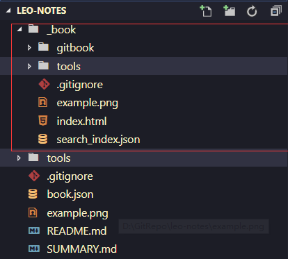

# 将gitbook发布到github page上
1. 为我们的项目创建gh-pages分支,这个分支用来存放项目构建后的静态文件，master分支存放源代码。
2. 在master分支下执行gitbook build 命令，将会在项目目录下生成_book文件夹，文件夹下则是gitbook根据我们的笔记构建的静态文件。

3. 将_book文件夹下的文件复制出来，将代码提交到gh-pages分支，注意不要包含_book目录。
4. 访问我们的项目地址，本项目的地址为https://github.com/sjhleo/leo-notes/